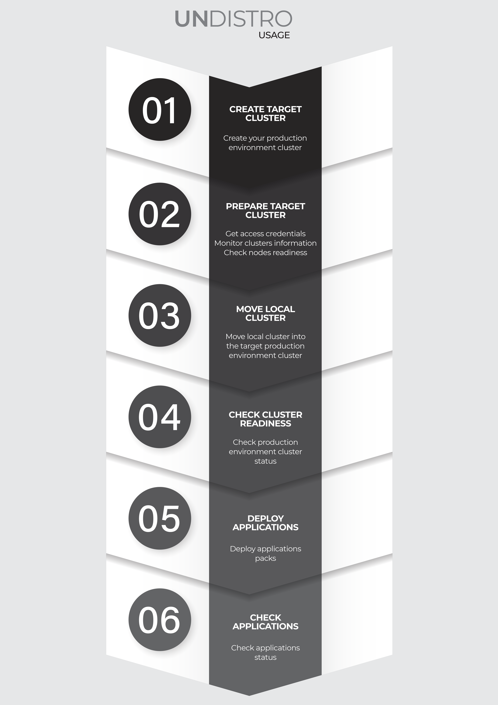

# UnDistro Kubernetes platform

## Documentation

### What is UnDistro (will be in version 1.0.0)?

UnDistro is an enterprise software that automates multicloud, on-prem, and edge operations with a single management UI.

UnDistro automates thousands of Kubernetes clusters across multi-cloud, on-prem and edge with unparalleled resilience. Deploy, manage and run multiple Kubernetes clusters with our platform. On your preferred infrastructure.

UnDistro Kubernetes Platform is directly integrated with leading cloud providers, and runs even in your own datacenter.

By providing managed Kubernetes clusters for your infrastructure, UnDistro makes Kubernetes as easy as it can be. UnDistro empowers you to take advantage of all the advanced features that Kubernetes has to offer and increases the speed, flexibility and scalability of your deployment workflow.

UnDistro provides live updates of your Kubernetes cluster without disrupting your daily business.

### Architecture

The overarching architecture of UnDistro is centered around a "management plane". This plane is expected to serve as a single interface upon which administrators can create, scale, upgrade, and delete Kubernetes clusters. At a high level view, the management plane + created clusters should look something like this:


### Requirements

- Install and setup [kubectl] in your local environment
- Install [Kind](https://kind.sigs.k8s.io/docs/user/quick-start/#installation) and [\[Docker\]](https://www.docker.com/get-started)

### Install and/or configure a kubernetes cluster

UnDistro requires an existing Kubernetes cluster accessible via kubectl; during the installation process the
Kubernetes cluster will be transformed into a [management cluster] by installing the UnDistro [provider components], so it
is recommended to keep it separated from any application workload.

It is a common practice to create a temporary, local bootstrap cluster which is then used to provision
a target [management cluster] on the selected [infrastructure provider].

Choose one of the options below:

1. **Existing Management Cluster**

For production use-cases a "real" Kubernetes cluster should be used with appropriate backup and DR policies and procedures in place.

```bash
export KUBECONFIG=<...>
```

2. **Kind**

[kind] is not designed for production use.

**Minimum [kind] supported version**: v0.9.0

</aside>

[kind] can be used for creating a local Kubernetes cluster for development environments or for
the creation of a temporary [bootstrap cluster] used to provision a target [management cluster] on the selected infrastructure provider.

### Quick start for AWS

**Create configuration file**
replace `<key>` to your keys

```yaml
providers:
  -
    name: aws
    configuration:
      accessKeyID: <key>
      secretAccessKey: <key>
      sessionToken: <key> # if you use 2FA
```

### Install UnDistro CLI
The UnDistro CLI tool handles the lifecycle of an UnDistro management cluster.

Download the latest version from the releases page https://github.com/getupio-undistro/undistro/releases.

### Initialize the management cluster

Now that we've got UnDistro CLI installed and all the prerequisites in place, let's transform the Kubernetes cluster
into a management cluster by using `undistro install`.

```bash
undistro --config undistro-config.yaml install   
```

### Adding SSH key on AWS account

Follow the AWS documentation https://docs.aws.amazon.com/AWSEC2/latest/UserGuide/ec2-key-pairs.html

### Creating a self hosted kubernetes on AWS

We will create a cluster with 3 controlplane node and 3 worker nodes

```yaml
apiVersion: app.undistro.io/v1alpha1
kind: Cluster
metadata:
  name: undistro-quickstart
  namespace: default
spec:
  kubernetesVersion: v1.19.5
  controlPlane:
    replicas: 3
    machineType: t3.medium
  workers:
    - replicas: 3
      machineType: t3.medium
  infrastructureProvider:
    name: aws
    region: us-east-1
    flavor: ec2
```

### Creating an EKS kubernetes on AWS

We will create a cluster with 3 worker nodes

```yaml
apiVersion: app.undistro.io/v1alpha1
kind: Cluster
metadata:
  name: undistro-quickstart
  namespace: default
spec:
  kubernetesVersion: v1.19.5
  workers:
    - replicas: 3
      machineType: t3.medium
  infrastructureProvider:
    name: aws
    region: us-east-1
    flavor: eks
```
**create a file with the content above.**

```
undistro create -f cluster-aws.yaml
```

### Waiting cluster to be ready to use

When the cluster is ready you will see the output **Cluster reconciliation succeeded** using the command below:

```
undistro get clusters
```

### See the creation progress


```
undistro show-progress undistro-quickstart -n default
```

### Getting cluster kubeconfig

```
undistro get kubeconfig undistro-quickstart -n default
```

### Making a remote cluster to be your management cluster

```
undistro --config undistro-config.yaml move undistro-quickstart -n default
```

### Install Helm releases into a cluster

```yaml
---
apiVersion: app.undistro.io/v1alpha1
kind: HelmRelease
metadata:
    name: nginx
    namespace: default
spec:
  chart:
    repository: https://kubernetes.github.io/ingress-nginx
    name: ingress-nginx
    version: 3.19.0
  clusterName: default/undistro-quickstart
---
apiVersion: app.undistro.io/v1alpha1
kind: HelmRelease
metadata:
    name: kubernetes-dashboard
    namespace: default
spec:
  chart:
    repository: https://kubernetes.github.io/dashboard
    name: kubernetes-dashboard
    version: 3.0.2
  clusterName: default/undistro-quickstart
  autoUpgrade: true
  dependencies:
    -
      apiVersion: app.undistro.io/v1alpha1
      kind: HelmRelease
      name: nginx
      namespace: default
  afterApplyObjects:
    -
      apiVersion: rbac.authorization.k8s.io/v1
      kind: ClusterRoleBinding
      metadata:
        name: dashboard-access
      roleRef:
        apiGroup: rbac.authorization.k8s.io
        kind: ClusterRole
        name: cluster-admin
      subjects:
        - kind: ServiceAccount
          name: undistro-quickstart-dash
          namespace: default 
  values:
    ingress:
      enabled: true
    serviceAccount:
      name: undistro-quickstart-dash
```

We installed nginx ingress and kubernetes dashboard that depends of nginx and applied a ClusterRoleBinding afer kubernetes-dashboard installation.

It's also possible to apply objects before a helm release installation adding `beforeApplyObjects`.

If clusterName field is empty UnDistro will install chart in the mananagement cluster.

#### Helm Release auto upgrade

To enable auto upgrade foolow the example below:

```yaml
spec:
  autoUpgrade: true
```

UnDistro will check for new versions every 15 minutes.

**NOTE:** UnDistro doesn't upgrade major versions.


### Guides

#### Install


#### Usage



[Docker]: https://www.docker.com/
[kind]: https://kind.sigs.k8s.io/
[kubectl]: https://kubernetes.io/docs/tasks/tools/install-kubectl/
